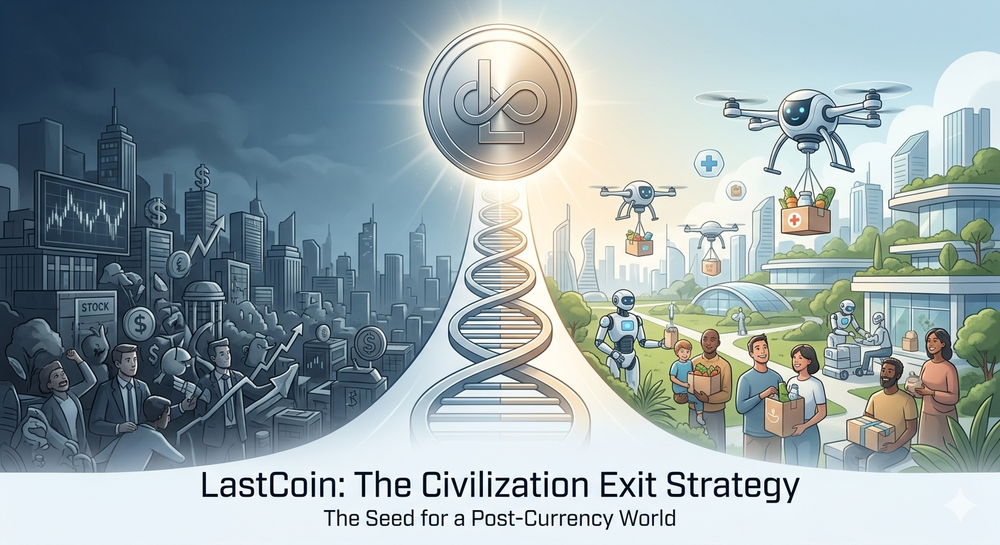
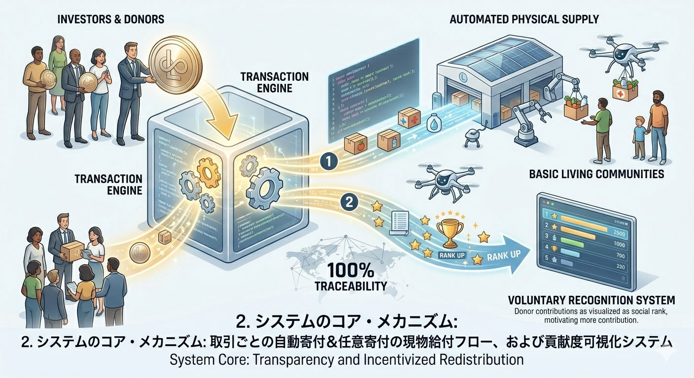
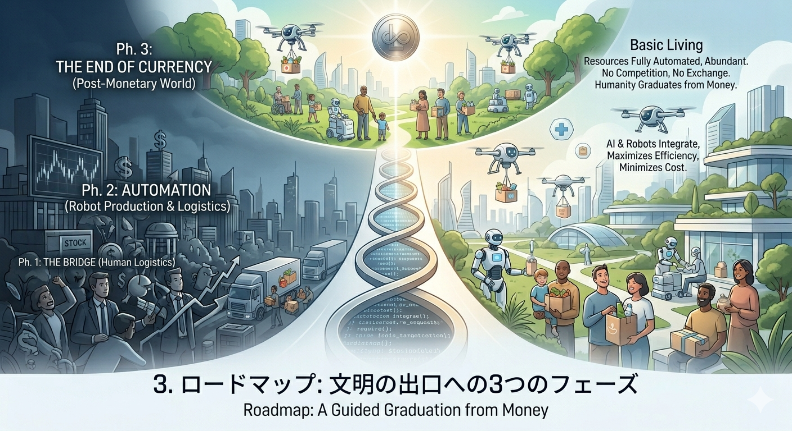

LastCoin: The Civilization Exit Strategy
​ラストコイン：文明の出口戦略
​English | 日本語
​
​English
​1. Concept: The Last Currency to End All Currencies
​LastCoin is not merely a cryptocurrency; it is a system designed to pivot the energy of human "greed" and "investment" toward social contribution. Its ultimate mission is to shepherd humanity into a "Basic Living" society—where AI and robots automate the supply of all essential resources—thereby allowing humanity to "graduate" from the necessity of currency itself.
​2. Core Mechanism

​Automated & Voluntary Donation Pool: A fixed percentage of every transaction is automatically diverted into a donation pool via smart contracts. Additionally, users can contribute directly to the pool at any time. Because it is governed by code, middleman exploitation is physically impossible.
​Physical Provision & Total Traceability: Contributions are distributed not as "cash," but as "physical goods" (food, medicine, daily necessities) leveraging existing logistics. Every contribution is 100% traceable, allowing donors to see exactly who their support reached.
​Hacking the Desire for Recognition: By visualizing contribution levels as social status (ranks), the system transforms the human ego and the desire for prestige into a powerful engine for wealth redistribution.
​3. Roadmap

​The Bridge Phase: Utilizing current global logistics and production, LastCoin expands its donation pool to provide physical goods to those in need, raising the global floor of survival.
​The Automation Phase: As AI and robots integrate into logistics and production, the cost of supply drops dramatically, maximizing the efficiency and reach of LastCoin’s support.
​The End of Currency: When resources are fully automated and abundant, the need for competition and exchange vanishes. LastCoin completes its mission as the "Last Coin," and humanity transcends the monetary system.
​4. Implementation and Global Scaling (Crucial)
​I am the Architect of this concept, not the Implementer.
​Technical Reason: I do not possess the programming expertise required to build this massive infrastructure.
​Survival Strategy: A decentralized approach—where multiple teams operate independently—has a far higher survival rate than a centralized project led by a single figurehead.
​Maximizing Success: This project should be launched spontaneously by diverse teams across the globe, tailored to their specific regions.
​To Engineers and Activists Worldwide:
This repository contains only the "Seed" (The Blueprint).
​Feel Free to Fork: No permission is required. Build a "LastCoin" optimized for your region and community.
​Compete and Evolve: Multiple implementations will drive rapid evolution, creating a decentralized network that is impossible to shut down.
​Start Now: Do not wait for a leader. Be the one to light the first fire.
​
​日本語
​1. コンセプト：通貨を終わらせるための、最後の通貨
​LastCoinは、単なる仮想通貨の提案ではありません。人間の「欲」や「投資」のエネルギーを社会貢献へ転換するシステムです。最終的にAIとロボットがすべてのリソースを供給する**「ベーシックリビング（Basic Living）」**社会へと人類を導き、通貨そのものの役割を終えさせる（卒業させる）ことを目的としています。
​2. システムのコア・メカニズム
​自動寄付＆任意寄付プール: すべての取引において一定額が自動的に寄付プールへ積み立てられます。また、ユーザーは任意のタイミングで自由に寄付を行うことも可能です。スマートコントラクトにより管理されるため、中抜きは物理的に不可能です。
​現物給付と徹底したトレーサビリティ: 寄付は「現金」ではなく、既存の物流網を利用した**「物品（現物）」**として届けられます。自分の支援が誰に届いたか、100%追跡可能です。
​承認欲求のシステム化: 「認められたい」という欲求を再分配のエンジンにするため、貢献度をランク化し可視化します。
​3. ロードマップ
​ブリッジ期: 既存の物流・生産網を利用。LastCoinを通じて世界中の困窮者へ現物給付を行い、生存のボトムアップ（底上げ）を図る。
​自動化の浸透期: 物流や生産にAI・ロボットが導入され、供給コストが劇的に低下。支援の効率が最大化される。
​通貨の終焉: あらゆるものが自動供給され、奪い合いや交換の必要がなくなることで、LastCoinは「最後の通貨」としての役目を終え、人類は通貨制度を卒業する。
​4. 実装と広がりについて（重要）
​私はこの構想の設計者（アーキテクト）であり、実装者ではありません。
​技術的理由: 私にはこの壮大なシステムを構築するためのプログラミング技術がありません。
​生存戦略: 一人のリーダーが運営する中央集権的なプロジェクトより、分散的に行った方がプロジェクトが生き残る確率は高くなります。
​成功確率の最大化: このプロジェクトは、世界中の多様なチームがそれぞれの場所で、勝手に、バラバラに立ち上げるべきです。
​世界中のエンジニア・活動家へ：
このリポジトリにあるのは**「種（設計図）」**だけです。
​自由にコピー（Fork）してください: 許可は不要です。あなたの地域、あなたのコミュニティに最適な「LastCoin」を作ってください。
​競い合ってください: 多くの人が異なる実装を試みることで、システムは進化し、止めることが不可能な「分散型のネットワーク」になります。
​勝手に始めてください: 「誰かがやる」のを待つのではなく、あなたが最初の火を灯してください。
​Disclaimer / 免責事項
​This repository is a thought experiment and a presentation of a concept. It is not an investment solicitation or an offer of any specific service. The architect assumes no responsibility for any activities conducted by third parties based on this content.
​本リポジトリの内容は思考実験および概念の提示であり、投資の勧誘や特定のサービスの提供を目的としたものではありません。本内容に基づき第三者が行ったいかなる活動についても、提唱者は一切の責任を負いません。
